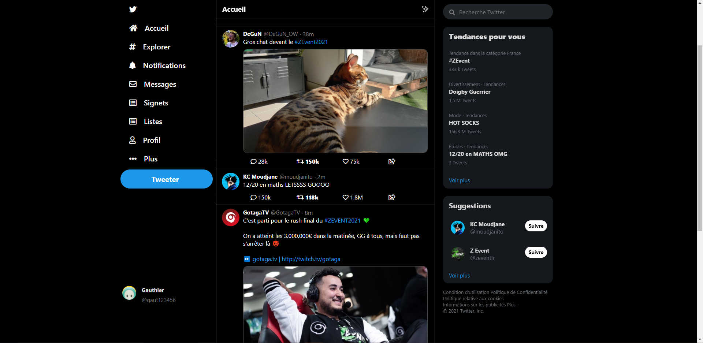
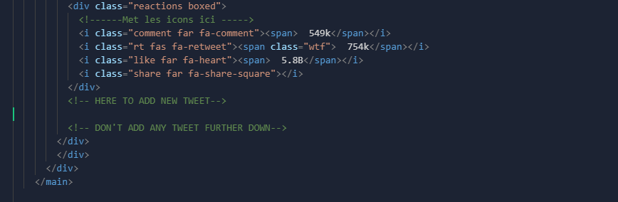

# Twitter Copycat

## Why

This project take parts in an educational basis, to learn easy an advanced feature of HTML5 CSS3. <br>
There is actually the first main page of Twitter

## To try at home

To try our code,<br>
 - Download the ZIP file with the green 'Code' button 
 - Unpack it
 - Run the HTML file
<br><br>
```diff
- /!\ Make sure to keep every file in the same folder, unless it will break it.
```
Or you can try it and modify on CodePen : <br>
https://codepen.io/angrysquirrell/pen/YzxdYvd <br>
```diff
+ (However, images will be missing ```¯\_(ツ)_/¯``` )`
```


## Future updates

In the futur, new features will be available like :
 - Working searchbar redirecting to the real twitter
 - Posibility to tweet through the copycat on the genuine site
 - Make sure that every button in the main page redirect to a coresponding copycat page

## How to modify

To add any tweets use the following steps :
 - Upload your images in ```./assets/img/```
 - Take the following code :

 ```html
         <div class="tweet"> 
          <div class="tweet-content">
          <!--  -->
          <div class="tweet__main">
            <div class="tweet__header">
              <div class="tweet__author-name">
                <!-- "AUTHOR'S NAME" -->
              </div>
              <div class="tweet__author-slug">
                <!-- "AUTHOR'S @" -->
              </div>
              <div class="tweet__publish-time">
                <!-- "PUBLICATION DATE" -->
              </div>
            </div>
            <div class="tweet__content">
              <!-- "TWEET CONTENT" -->
              <!-- <span class="hashtag">"HASHTAGS HERE"</span> -->
            </div>
            <!--  -->
          </div>
          </div>
          <div class="reactions boxed">
            <!-- <i class="comment far fa-comment"><span> NUMBER OF COMMENTS </span></i> -->
            <!-- <i class="rt fas fa-retweet"><span class="wtf">  NUMBER OF RETWEET </span></i> -->
            <!-- <i class="like far fa-heart"><span>  NUMBER OF LIKE</span></i> -->
            <i class="share far fa-share-square"></i>
          </div>
        </div>  
  ```

 - Make sure to change in every comment and uncomment it (remove the <!-- # -->)
 - Paste your home-made code between the mentionning beacons in index.html (line ~244) 


 - Here we go, you added a new tweet ! Well done :)
```diff
  - /!\ Make sure to keep the "" when there is some !
```

## Architecture

index.html<br>
assets/<br>
├─ css/<br>
│  ├─ style.css<br>
├─ img/<br>
│  ├─ howto.PNG<br>
│  ├─ look.PNG<br>
│  ├─ pp_gaut123456.jpg<br>
│  ├─ pp_moudjanito.png<br>
│  ├─ pp_zevent.jpg<br>
│  ├─ ppgotaga.png<br>
│  ├─ pptweet1.png<br>
│  ├─ stars.png<br>
│  ├─ tweet1.jfif<br>
│  ├─ tweet2.jpg<br>
│  ├─ twitzevent.jpg<br>
│  ├─ Zevent.png<br>
favicon.png<br>


## Who ?

Project made with love by:

```Moudjane``` aka Mathis Oudjane as Developper & CEO,

```Nao``` aka Nao Mausservey as Lead Developper,

```AngrySquirrel``` aka Guillaume Maugin as Developper Fullstack,

```gaut123456``` aka Gauthier Duffier as Developper & Happiness Manager,

Using HTML5 & CSS3
